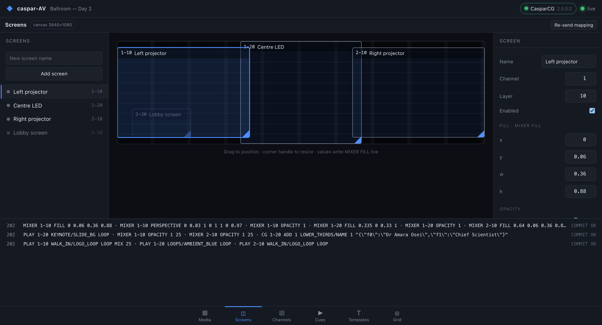
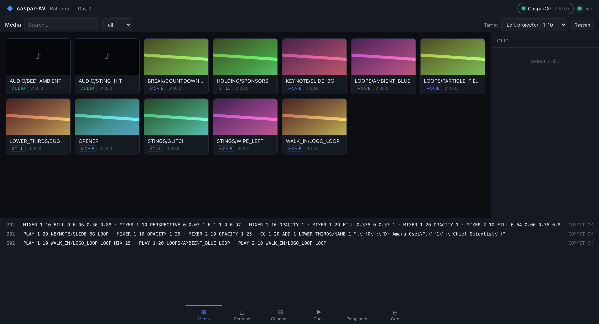
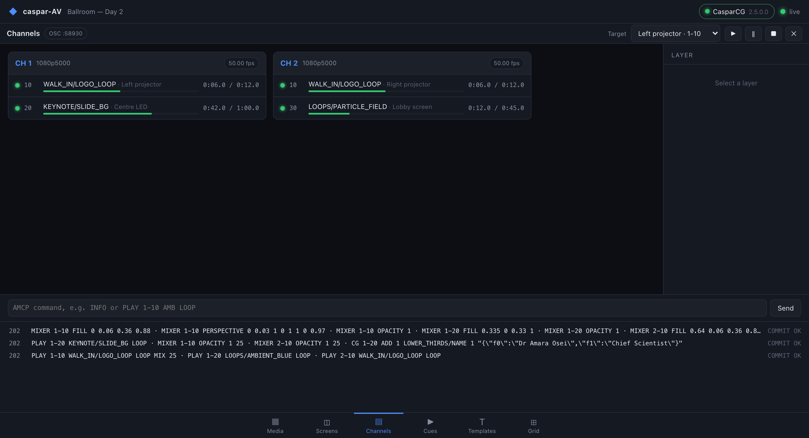
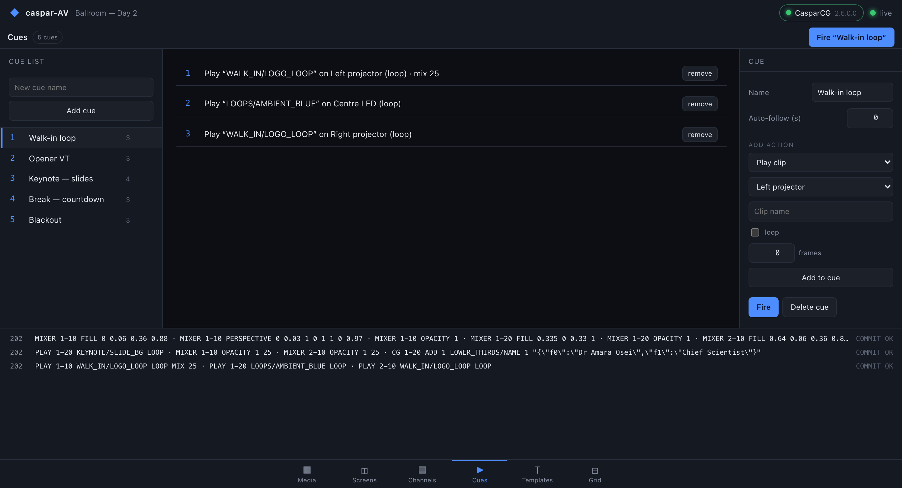
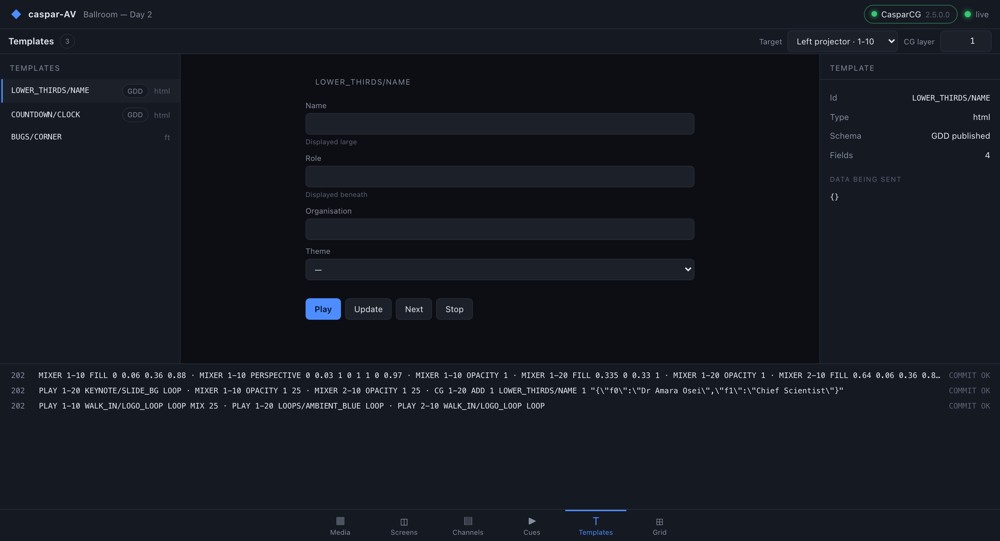
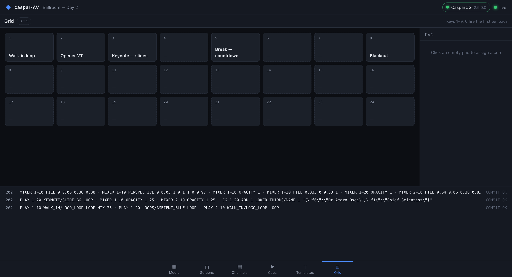

# caspar-AV

> **AI-assisted project.** This codebase was created with [Claude Code](https://claude.com/claude-code)
> (Anthropic), directed and reviewed by a human author. The protocol work was
> derived from the CasparCG 2.5.0 source and then **verified against a real
> CasparCG 2.5.0 server** (Ubuntu 24.04, headless, Mesa llvmpipe) — which caught
> six genuine bugs, including a command-ordering mistake that broke every
> `MIXER` and `CG` command. It has **not** been run on real output hardware or
> in a live show. Validate on your own rig before relying on it.

A **live-events media server built on CasparCG** — screens on a canvas, cues that
change several of them on one frame, a media library, graphics templates and a
trigger grid, in a browser.

Not affiliated with or endorsed by the CasparCG project.



> Four outputs placed on a 3840×1080 show canvas. Dragging a screen writes
> `MIXER FILL`; the corner-pin numbers write `MIXER PERSPECTIVE`. Every command
> sent is in the log along the bottom.

**Click around the console: <https://caspar-av-demo.stoatworks-labs.com>** — the real
console in your browser, and **firing a cue works**: the command log fills with
the AMCP the bridge actually compiled for it. It replays a recording of
`caspar-avd` running against `scripts/fake-caspar.py`, so nothing is driving a
real server and nothing is saved. See [demo/README.md](demo/README.md).

## Why this exists

[CasparCG Server](https://github.com/CasparCG/server) is a superb playout engine
with an odd gap around it: the organisation's own `Frontend` is archived, and the
maintained client is a Qt desktop app. There is no maintained web front end.

More to the point, CasparCG is presented as a *broadcast playout* engine, while
the pieces needed to drive it as a *live-events media server* are already in it
and simply unexposed:

| What a media server needs | What CasparCG already has |
|---|---|
| Screens placed on a show canvas | `MIXER FILL` — position and scale, in normalised units |
| Projector keystone / corner-pin | `MIXER PERSPECTIVE` — a real four-corner warp |
| Cues that change several outputs at once | `BEGIN` / `COMMIT` — locks every touched channel, releases on one frame |
| Soft-edge blending, masking | `MIXER CLIP`, `MIXER CROP`, blend modes |
| A media library with thumbnails | `media-scanner`, over HTTP |
| Data-driven graphics | HTML templates with **GDD** schemas |

caspar-AV adds the layer above: a **show** — canvas, screens, cues, pads — that
compiles down to those commands.

## Why a daemon and not just a web page

CasparCG speaks **AMCP over raw TCP** (port 5250) and pushes state as **OSC over
UDP**. A browser can do neither. So caspar-AV is a small Rust daemon that holds
the connection and serves a React console over ordinary HTTP:

```
Browser console (React/Vite)
        │  REST + WebSocket (snapshot mirror)
caspar-avd (Rust)                     ← show model, cue compiler, command log
        │  AMCP/TCP 5250      │  OSC/UDP        │  HTTP 8000
CasparCG Server 2.5           telemetry          media-scanner
```

The console is a **passive mirror**: it holds no authoritative state, renders the
daemon's snapshot and sends commands. Two operators on two laptops see the same
thing, and a browser that reconnects is immediately correct.

## Status

Built, tested, and **verified against a real CasparCG 2.5.0 server**.

- **`amcp`** — protocol codec and async client. Command building with the
  server's real escaping rules, response framing by status code, `REQ`/`RES`
  correlation, `BEGIN`/`COMMIT` batching. 38 tests.
- **`casparosc`** — OSC decoder and the telemetry state tree, raw plus a typed
  digest. 13 tests.
- **`scanner`** — media-scanner client: media with ffprobe metadata, thumbnails,
  templates with GDD schemas, fonts. 5 tests.
- **`showd`** (`caspar-avd`) — the bridge: supervised connection with reconnect,
  telemetry subscription, show model and cue compiler, REST + WebSocket API,
  serves the console. 12 tests.
- **console** — six pages on one shared frame, ported from
  [OpenStage](https://github.com/stoatworks-labs/openstage)'s console.

**Verified against real CasparCG 2.5.0** — `scripts/protocol-probe.py` checks 22
protocol claims with raw sockets (sharing no code with the crates, so it can
disprove them), and `scripts/verify-mapping.py` has the server `PRINT` real
frames to confirm `MIXER FILL` and `MIXER PERSPECTIVE` actually move pixels.
See [docs/scope.md](docs/scope.md) for what that does and does not cover.

**Not built:** timeline/timecode playback, auto-follow execution (cues carry a
follow time; nothing fires it yet), soft-edge blending UI, MIDI/OSC control in,
multi-server rigs, audio metering.

## Getting started

```bash
cargo build --release
cd console && npm ci && npm run build && cd ..
./target/release/caspar-avd --host <your-caspar-host> --show myshow.json
```

Then open <http://localhost:8080>.

No CasparCG to hand? Run the fake one. It speaks real AMCP framing, real
`REQ`/`RES` correlation and pushes real OSC telemetry — and stands in for
media-scanner too, so the Media and Templates pages have something to show:

```bash
python3 scripts/fake-caspar.py
```

Against a real server, check the protocol assumptions still hold:

```bash
python3 scripts/protocol-probe.py --host <your-caspar-host>
```

## The pages

Six pages on one shared frame, with the command log always along the bottom —
because "did that command actually land?" is the question a show asks most.

<table>
<tr>
<td width="50%">

**Media** — the library from media-scanner, with thumbnails. Double-click to
play onto the target screen.


</td>
<td width="50%">

**Channels** — live state straight from OSC: what is playing, position and
duration, plus a raw AMCP command line for when something is wrong.


</td>
</tr>
<tr>
<td width="50%">

**Cues** — several screens changed together. Fired as one `BEGIN`/`COMMIT`
batch, so every screen changes on the same frame.


</td>
<td width="50%">

**Templates** — where a template publishes a **GDD** schema, the data form is
generated from it rather than typed as JSON.


</td>
</tr>
<tr>
<td width="50%">

**Grid** — cues as trigger pads. Number keys 1–9 and 0 fire the first ten.


</td>
<td width="50%">

**Screens** — output mapping, shown at the top of this page.

Every screenshot here is a real render against
`scripts/fake-caspar.py`, captured by `scripts/screenshots.py`.
</td>
</tr>
</table>

## Documentation

| Doc | What it covers |
|---|---|
| [amcp.md](docs/amcp.md) | The protocol, as the 2.5.0 source actually implements it — including where the wiki is wrong |
| [architecture.md](docs/architecture.md) | Components, the snapshot contract, the show model and how cues compile |
| [decisions.md](docs/decisions.md) | Every significant choice, why it won, and what is still open |
| [diagnostics.md](docs/diagnostics.md) | Where the logs are, what a crash report contains, and how to send one file that explains a fault |
| [scope.md](docs/scope.md) | Honestly what is built, what is partial, what is not started |
| [releasing.md](docs/releasing.md) | How the six-platform release is built, locally |
| [test-server.md](docs/test-server.md) | Running a real CasparCG to test against, on a Mac |

## Inspired by

caspar-AV is not a clone of any of these, and is not affiliated with them. They
are listed because the ideas are theirs, and pretending otherwise would be
dishonest.

- **Pixera, disguise, Millumin and Resolume** — the show model. Screens placed
  on a canvas, corner-pin per output, and a cue that changes several screens on
  one frame are all conventions these established. What caspar-AV does is show
  that CasparCG already has the primitives to work that way.
- **DaVinci Resolve** — the shape of the console: a bottom page-tab bar, and
  every page built from the same toolbar / left / centre / right / bottom frame
  with a context inspector on the right.
- **[OpenStage](https://github.com/stoatworks-labs/openstage)** — the console
  shell itself, the snapshot-mirror architecture, and the WebSocket-with-polling
  connection layer, all ported directly from its own console.
- **[CasparCG](https://github.com/CasparCG/server)** — the engine that does all
  the actual work here.

## Licence

MIT — see [LICENSE](LICENSE). caspar-AV speaks to CasparCG over the wire and
links none of its code, so its GPL does not reach this project.
